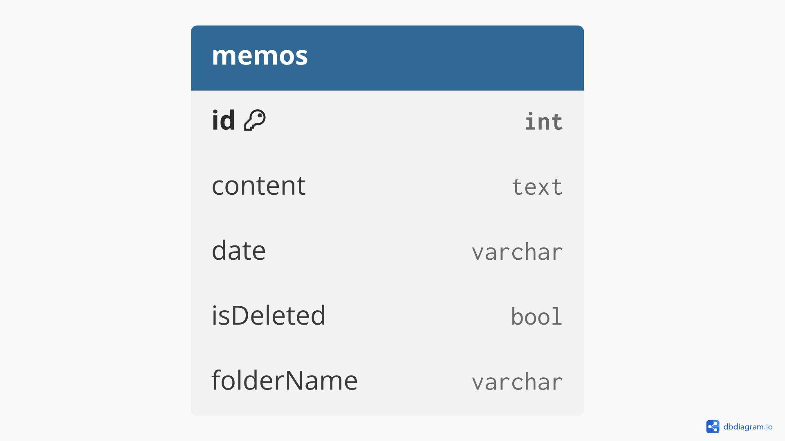
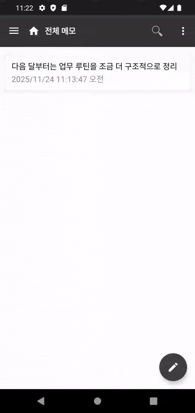
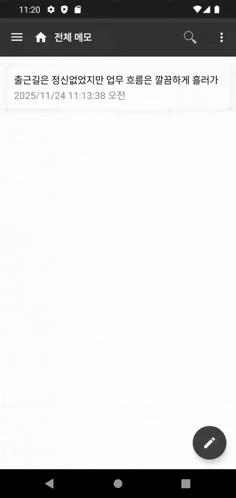
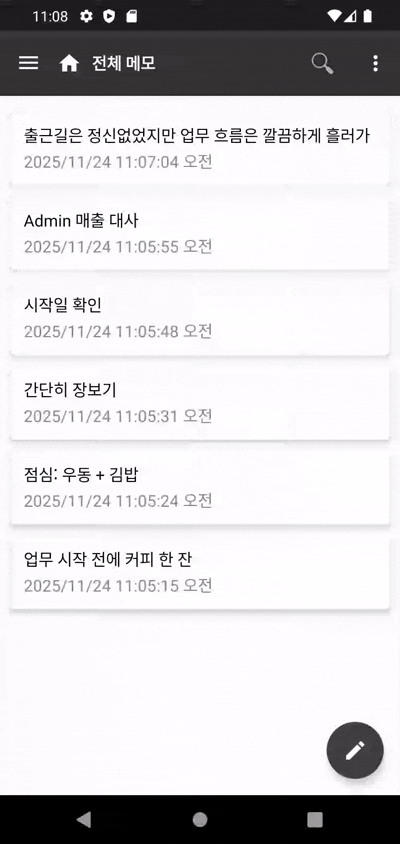
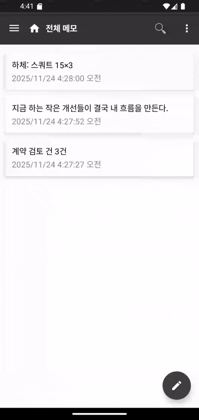
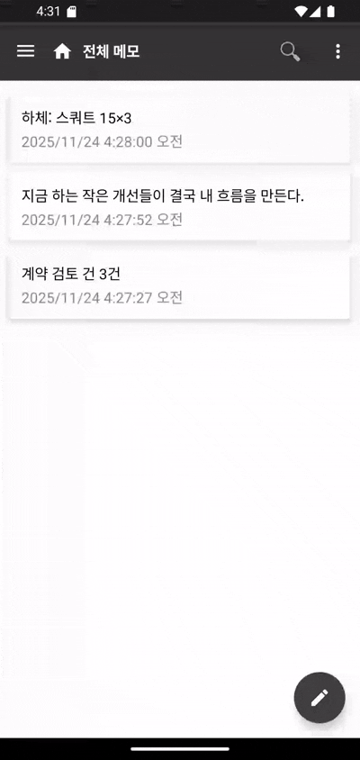
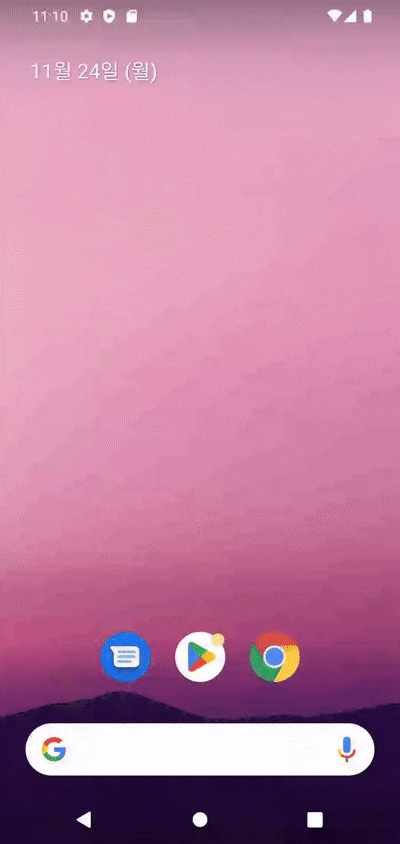
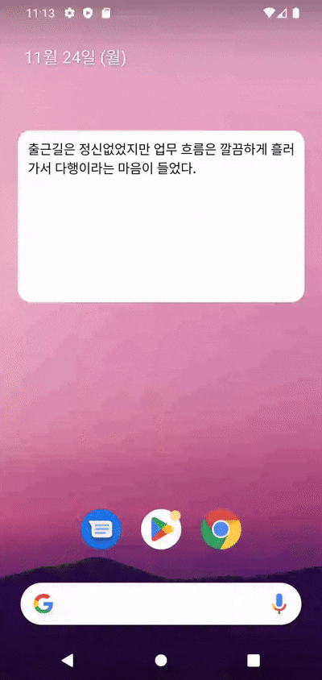
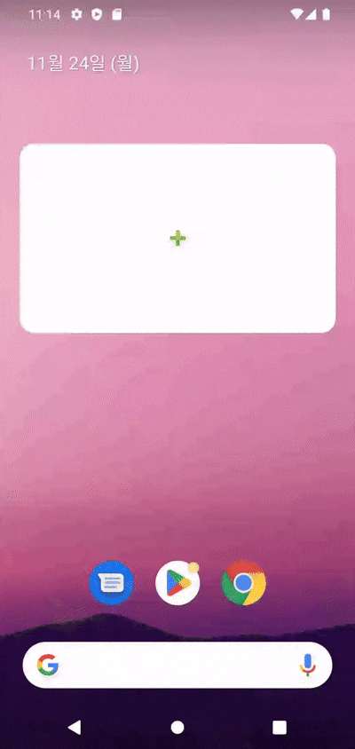

# 📝 Simple Notepad  

  
  
**Simple Notepad**는 텍스트 기록에 집중한 간단한 메모 앱입니다.  
필요한 기능만 담아 누구나 쉽게 쓸 수 있도록 제작되었습니다.  

## 주요 기능

-  **홈 화면 위젯 지원**  
  원하는 메모를 선택해서 위젯에 고정할 수 있습니다.
-  **메모 자동 저장**  
  작성 중인 메모는 앱을 나가도 자동으로 저장됩니다.
-  **휴지통 기능**  
  실수로 삭제한 메모도 복구할 수 있어요
-  **텍스트 크기 조절**  
  작게 / 보통 / 크게로 편하게 설정할 수 있어요
-  **공유 기능**  
  메모 내용을 다른 앱으로 쉽게 공유할 수 있습니다.
-  **폴더별 분류**  
  메모를 원하는 폴더로 나눠 정리할 수 있어요

## 사용된 기술 스택

- Kotlin
- MVVM + ViewModel
- Room Database
- DataBinding
- AppWidgetProvider (위젯)
- Material3 Components    

## 프로젝트 구조

com.simple.memo  
├── data         # Room 관련 (MemoEntity, MemoDao 등)  
├── ui           # UI 구성 (Fragment, Adapter, Activity 등)  
├── util         # 공통 유틸리티 (텍스트 사이즈 등)  
├── viewModel    # ViewModel 및 상태 관리  

## DB 구조

  

## 실제 동작 화면  

| 화면 | 설명 |
| ---- | ---- |
|  | **신규 메모 작성** 입력한 내용으로 새 메모가 생성됩니다. |
|  | **메모 삭제 및 복구** 메모를 삭제하고 복원할 수 있습니다. |
|  | **메모 검색** 보관 중인 메모 중 원하는 내용을 검색해 빠르게 찾아볼 수 있습니다. |
|  | **다중 삭제** 여러 메모를 한 번에 선택해 일괄 삭제할 수 있는 기능입니다. |
|  | **폴더 추가** 새 폴더를 생성하여 폴더별로 메모를 정리하고 작성할 수 있습니다. |
|  | **위젯 추가** 홈 화면에 메모 위젯을 추가해 앱을 열지 않아도 메모를 바로 확인할 수 있습니다. |
|  | **위젯 실시간 반영** 앱에서 메모 내용을 수정하면 위젯에도 즉시 반영됩니다. |
|  | **위젯 스크롤** 내용이 긴 메모도 위젯에서 스크롤을 통해 확인할 수 있습니다. |  

## 화면 캡쳐 

| 전체 메모 | 글쓰기 화면 |
|--------|----------|
|  |  |

| 환경 설정 | 메모 위젯 |
|-----------|-----------|
|  |  |

## 개발자

- GitHub: [daengjun](https://github.com/daengjun)
- Email: jundroidx@gmail.com  

